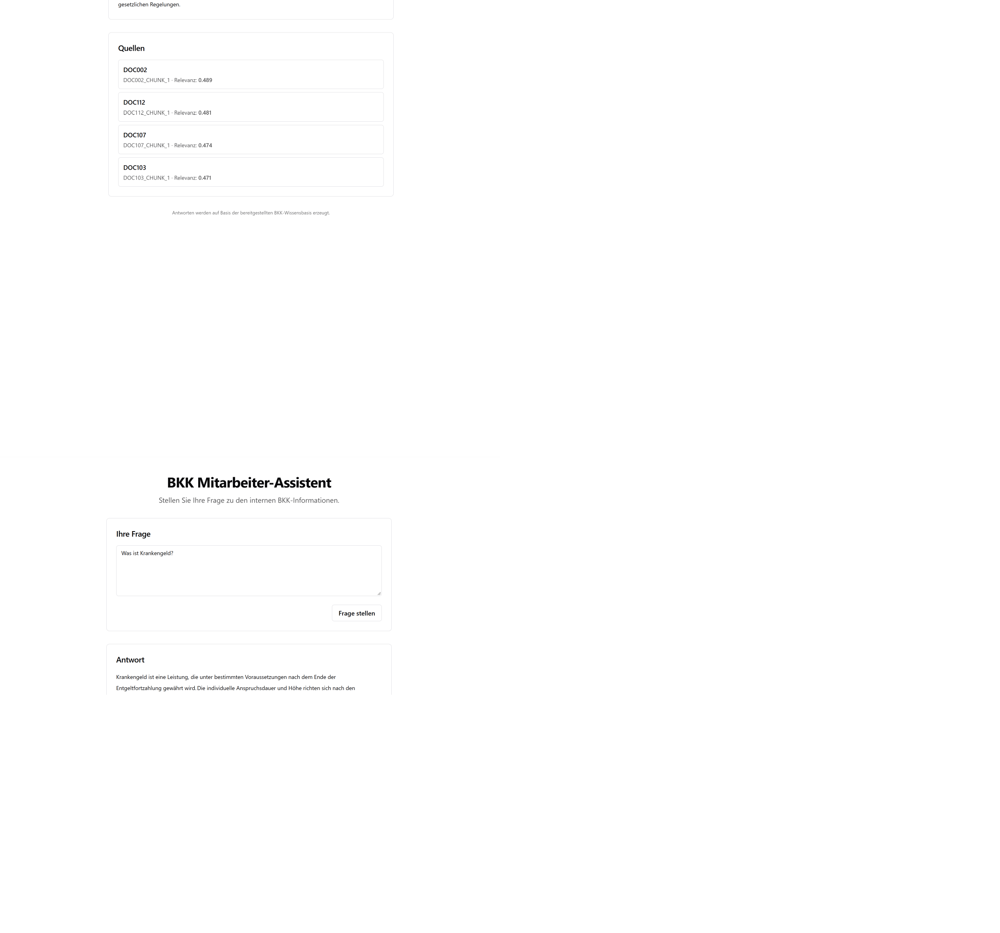
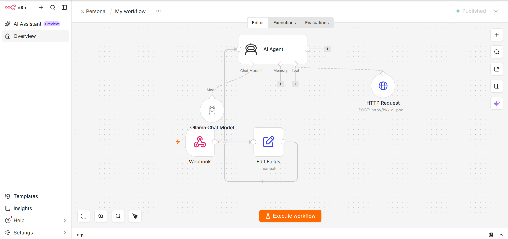
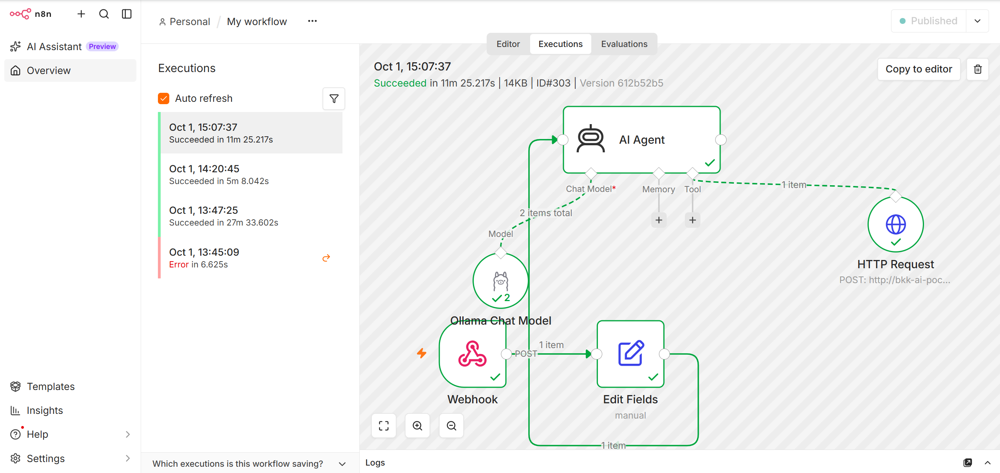

# BKK Mitarbeiter-Assistent

A full-stack **Retrieval-Augmented Generation (RAG) assistant** for answering questions about internal BKK information.

The application is implemented as a **Databricks App** using **Databricks AppKit, React, TypeScript, Express, Databricks Vector Search, Unity Catalog, Model Serving, and a MiniLM embedding model**.

The goal of the proof of concept is to provide employees with concise answers that are grounded in the available BKK knowledge base and accompanied by the retrieved source documents.

---

## Demo

### Frontend

The deployed Databricks application provides a simple employee-facing interface for submitting questions and displaying grounded answers together with their sources.



### n8n Workflow

The project was also validated through an n8n-based AI/RAG workflow during development.



### Successful Execution

The n8n workflow was successfully executed end-to-end.



---

## Key Features

* Natural-language question answering in German
* Retrieval-Augmented Generation (RAG)
* Databricks Vector Search for semantic retrieval
* MiniLM embeddings with **384 dimensions**
* Databricks Model Serving for embeddings
* Databricks-hosted LLM for answer generation
* Unity Catalog integration
* Source references shown in the frontend
* Prompt constraints to reduce unsupported answers
* Full-stack React + TypeScript + Express architecture
* Deployment as a Databricks App

---

## Architecture

```text
                          ┌───────────────────────┐
                          │        Employee       │
                          │                       │
                          │  "Was ist Krankengeld?"│
                          └───────────┬───────────┘
                                      │
                                      ▼
                          ┌───────────────────────┐
                          │    React Frontend     │
                          │ TypeScript · Vite     │
                          └───────────┬───────────┘
                                      │
                                      │ POST /api/ask
                                      ▼
                    ┌──────────────────────────────────┐
                    │        Databricks App            │
                    │                                  │
                    │ Express + Databricks AppKit      │
                    └───────────────┬──────────────────┘
                                    │
                    ┌───────────────┴────────────────┐
                    │                                │
                    ▼                                ▼
        ┌──────────────────────┐          ┌──────────────────────┐
        │   MiniLM Embedding   │          │  Databricks LLM      │
        │   Model Serving      │          │  Model Serving       │
        │   384 dimensions      │          │  GPT OSS 120B        │
        └──────────┬───────────┘          └──────────▲───────────┘
                   │                                 │
                   ▼                                 │
        ┌──────────────────────┐                     │
        │  Databricks Vector   │                     │
        │       Search         │                     │
        │                      │                     │
        │ document_chunks_     │                     │
        │ index                │                     │
        └──────────┬───────────┘                     │
                   │                                 │
                   │ Top 4 relevant chunks           │
                   ▼                                 │
        ┌──────────────────────┐                     │
        │ BKK Knowledge Base   │─────────────────────┘
        │ Unity Catalog        │
        │ document_chunks      │
        └──────────────────────┘
```

---

## RAG Pipeline

The request processing flow is:

```text
Question
   │
   ▼
Generate query embedding
   │
   ▼
Databricks Vector Search
   │
   ▼
Retrieve relevant BKK chunks
   │
   ▼
Build constrained prompt
   │
   ▼
Databricks LLM
   │
   ▼
Answer + source references
   │
   ▼
React Frontend
```

### 1. User Question

The employee submits a natural-language question through the React frontend.

Example:

```text
Was ist Krankengeld?
```

### 2. Query Embedding

The question is converted into a **384-dimensional vector** using the deployed MiniLM embedding model.

### 3. Vector Search

Databricks Vector Search queries:

```text
workspace.healthcare_ai.document_chunks_index
```

The application retrieves the most relevant chunks from the BKK knowledge base.

### 4. Context Construction

The retrieved chunks are inserted into a constrained prompt.

The application instructs the LLM to:

* use only the retrieved context
* avoid inventing facts, amounts, deadlines, or requirements
* avoid mixing unrelated BKK topics
* explicitly state when the available information is insufficient
* answer in German
* keep the answer concise

### 5. LLM Generation

The contextualized prompt is sent to the Databricks LLM endpoint.

### 6. Source Display

The frontend displays both the generated answer and the retrieved source documents.

Example:

```text
Antwort

Krankengeld ist eine Leistung, die unter bestimmten
Voraussetzungen nach dem Ende der Entgeltfortzahlung
gewährt wird.

Quellen

DOC002
DOC112
DOC107
DOC103
```

---

## Databricks Resources

The application currently uses the following Databricks resources.

| Resource                   | Configuration                                    |
| -------------------------- | ------------------------------------------------ |
| Databricks App             | `bkk-ai-assistant`                               |
| Vector Search Endpoint     | `bkk-ai-search`                                  |
| Vector Search Index        | `workspace.healthcare_ai.document_chunks_index`  |
| Source Table               | `workspace.healthcare_ai.document_chunks`        |
| Embedding Model            | `workspace.healthcare_ai.minilm_embedding_model` |
| Embedding Dimension        | 384                                              |
| Embedding Serving Endpoint | `minilm-embedding`                               |
| LLM Serving Endpoint       | `databricks-gpt-oss-120b`                        |
| Retrieved Results          | 4 chunks per question                            |

---

## Data Layer

The knowledge base is stored in Unity Catalog:

```text
workspace.healthcare_ai.document_chunks
```

The Vector Search index is:

```text
workspace.healthcare_ai.document_chunks_index
```

The current proof-of-concept index contains the BKK document chunks used for retrieval.

The source table has **Change Data Feed enabled**, allowing it to be used with the Delta Sync Vector Search index.

---

## Security and Access Control

The Databricks App runs with its own service principal.

The application service principal is granted access to the required Databricks resources:

```text
Vector Search Index
    SELECT

Vector Search / Unity Catalog
    USE_CATALOG
    USE_SCHEMA

Embedding Model Serving Endpoint
    CAN_QUERY

LLM Serving Endpoint
    CAN_QUERY
```

Secrets and authentication credentials are not part of the frontend bundle.

Local credentials should be stored only in environment configuration and should never be committed to Git.

---

## n8n Development Workflow

During development, the RAG concept was also tested using an n8n workflow with Ollama.

```text
User Question
     │
     ▼
    n8n
     │
     ▼
AI Agent
     │
     ├──────────────► Ollama / qwen2.5:3b
     │
     ▼
BKK RAG Search
     │
     ▼
Databricks Knowledge Base
```

The n8n workflow was used to validate the orchestration and retrieval concept before completing the Databricks App deployment.

The Databricks App is the deployed user-facing implementation.

---

## Project Structure

```text
bkk-ai-assistant/
│
├── client/
│   ├── src/                         # React frontend
│   └── public/                      # Static assets
│
├── server/
│   └── server.ts                    # Express + RAG backend
│
├── shared/                          # Shared application types
│
├── scripts/                         # Utility scripts
│
├── docs/
│   └── screenshots/
│       ├── 01-n8n-workflow.png
│       ├── 02-successful-execution.png
│       └── 03-frontend.png
│
├── app.yaml                         # Databricks App configuration
├── databricks.yml                   # Databricks Asset Bundle configuration
├── appkit.plugins.json              # AppKit plugin configuration
├── .env.example                     # Environment configuration template
├── package.json
└── README.md
```

---

## Technology Stack

### Frontend

* React
* TypeScript
* Vite
* Tailwind CSS
* shadcn/ui
* Radix UI

### Backend

* Node.js
* Express
* TypeScript
* Databricks SDK
* Databricks AppKit

### AI / RAG

* Databricks Vector Search
* MiniLM embeddings
* 384-dimensional embeddings
* Databricks Model Serving
* Databricks GPT OSS 120B
* Unity Catalog

### Deployment

* Databricks Apps
* Databricks Asset Bundles
* Databricks CLI

### Development / Orchestration

* n8n
* Ollama
* qwen2.5:3b

---

## Local Development

### Prerequisites

* Node.js 22+
* npm
* Databricks CLI
* Access to a Databricks workspace

### Install dependencies

```bash
npm install
```

### Configure environment

Create a local environment file:

```bash
cp .env.example .env
```

Configure the required Databricks settings for the target workspace.

Do **not** commit `.env` or credentials to Git.

### Development server

```bash
npm run dev
```

### Production build

```bash
npm run build
```

The production build generates:

```text
dist/
client/dist/
```

---

## Databricks Deployment

The project uses Databricks Apps and Databricks Asset Bundles.

### Deploy

```bash
databricks apps deploy
```

The deployment process validates the project, builds the application, uploads the source, and starts the Databricks App.

### Start an existing App

```bash
databricks apps start bkk-ai-assistant
```

### Check App status

```bash
databricks apps get bkk-ai-assistant
```

### View application logs

```bash
databricks apps logs bkk-ai-assistant --tail-lines 50
```

---

## Deployment Result

The current proof-of-concept has been successfully deployed as a Databricks App.

Current state:

```text
Application        RUNNING
App Compute        ACTIVE
Deployment         SUCCEEDED
Vector Search      ONLINE
Vector Index       READY
Indexed Rows       18
```

The deployed application provides a working question-answering flow from the React frontend through the Databricks backend, vector retrieval, and LLM generation.

---

## Current Limitations

This repository represents a **proof of concept** rather than a production-ready healthcare application.

Current limitations include:

* limited knowledge-base size
* limited evaluation dataset
* no production authentication/authorization design
* no comprehensive automated evaluation suite
* no production monitoring and observability stack
* no formal legal/compliance validation
* no guarantee that every possible employee question can be answered from the available knowledge base

The system is intentionally designed to prefer an explicit "insufficient information" response over unsupported answers.

---

## Possible Next Steps

Potential extensions include:

* larger and continuously updated BKK knowledge bases
* automated retrieval and answer evaluation
* feedback collection from users
* application telemetry and monitoring
* stronger access-control integration
* document ingestion pipelines
* improved citation display
* answer-quality benchmarks
* production deployment architecture

---

## Screenshots

The GitHub repository contains the following implementation evidence:

```text
docs/screenshots/01-n8n-workflow.png
docs/screenshots/02-successful-execution.png
docs/screenshots/03-frontend.png
```

The frontend screenshot demonstrates the deployed assistant, including the generated response and retrieved source references.

---

## Project Status

**Proof of Concept – successfully deployed on Databricks**

The main end-to-end flow has been validated:

```text
React Frontend
      │
      ▼
Databricks App
      │
      ▼
Vector Search
      │
      ▼
BKK Knowledge Base
      │
      ▼
Databricks LLM
      │
      ▼
Answer + Sources
```

---

## Author

**souldest**

[GitHub](https://github.com/souldest)
